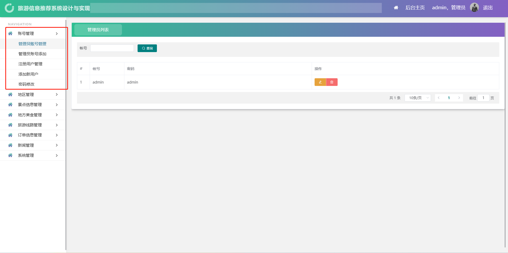
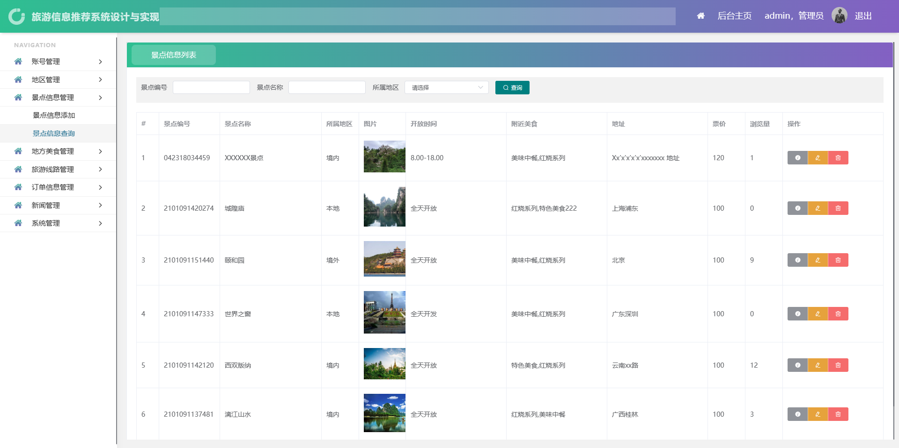
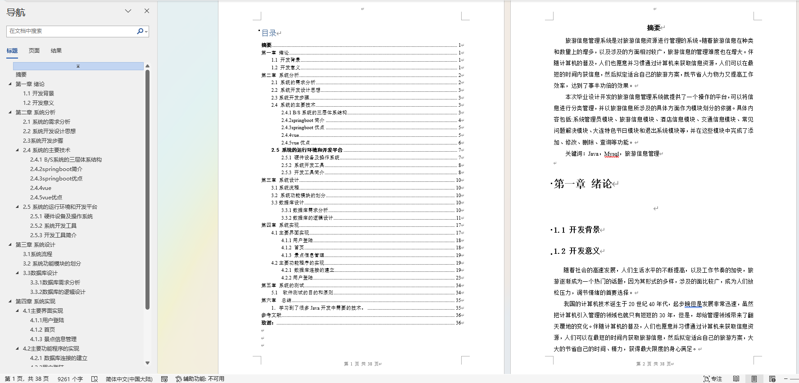

# 旅游信息推荐系统

运行环境:idea或eclipse vscode 数据库:mysql

## 一、介绍

### springboot+mybatis+vue前后端分离的旅游信息推荐系统

开发语言：java

功能简介：系统分为前台跟后台两个项目

用户：  浏览旅游新闻、景区信息、美食信息、旅游线路、在线留言、旅游线路、订单信息

管理员： 账号管理、地区管理、景点信息管理、地方美食管理、旅游线路管理、订单信息管理、新闻管理、系统管理


## 二、游客和用户界面部分功能页面展示


## 三、管理员界面部分功能页面展示






## 四、9000字文档参考



## 五、视频演示

```
链接：https://pan.baidu.com/s/1NmDHzIBmiUJjpc7Tj7J2gQ?pwd=irz3

提取码：irz3

--来自百度网盘超级会员V6的分享
```

## 六、 9.9￥ 获取完整源码+sql，带9000字论文参考，需要加Q：3808981644 备用Q：3577148218


